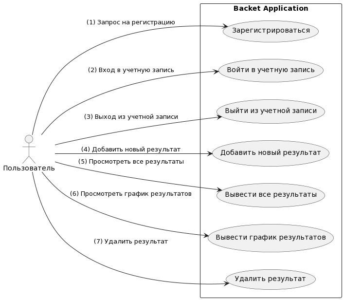

# Диаграмма вариантов использования

---

## Варианты использования

---

## Возможности

1. **Зарегистрироваться**
   - Желаете создать свой аккаунт? Просто зарегистрируйтесь и начните использовать все функции приложения.

2. **Войти в учетную запись**
   - Если у вас уже есть аккаунт, просто войдите в учетную запись, используя свои учетные данные.

3. **Выйти из учетной записи**
   - В любой момент вы можете безопасно выйти из своей учетной записи.

4. **Добавить новый результат**
   - Зафиксируйте результат своей игры, добавив новую запись.

5. **Вывести все результаты**
   - Просмотрите общие результаты всех своих игр.

6. **Вывести график результатов**
   - Оцените динамику ваших игр, просматривая график результатов.

7. **Удалить результат**
   - Если нужно, удалите запись о конкретной игре.

## Как использовать

1. **Регистрация и вход**
   - Запустите приложение, зарегистрируйтесь, если у вас еще нет аккаунта, или войдите, используя свои учетные данные.

2. **Добавление результата**
   - После входа выберите опцию "Добавить новый результат", чтобы внести свой последний игровой результат.

3. **Просмотр результатов**
   - Воспользуйтесь функцией "Вывести все результаты", чтобы увидеть свои прошлые игры.

4. **Просмотр графика результатов**
   - Чтобы увидеть динамику своих игр, выберите "Вывести график результатов".

5. **Удаление результата**
   - Если вам нужно удалить какую-то запись, воспользуйтесь опцией "Удалить результат".